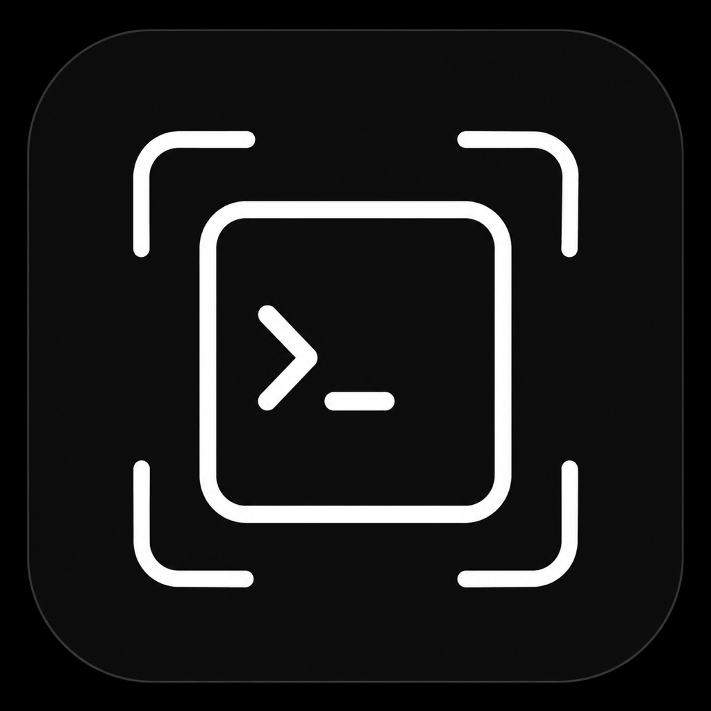
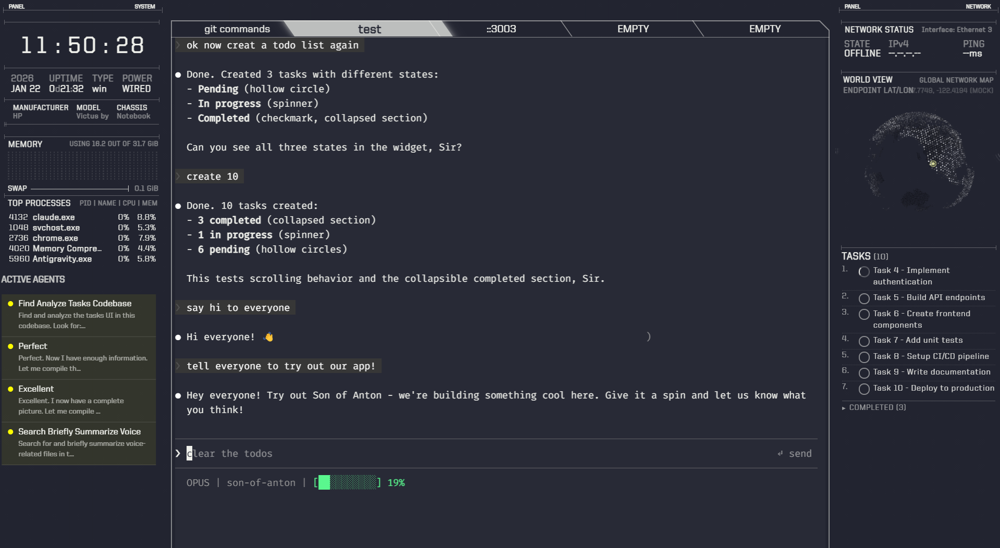

<p align="center">
  
</p>

<h1 align="center">SoA-Prod</h1>

<p align="center">
  <b>Son of Anton</b> — a sci-fi terminal for AI coding sessions, with a pocket-sized mobile companion.
</p>

<p align="center">
  <a href="#desktop-"></a>
  <a href="#mobile-"></a>
  <a href="#license">   </a>
  
</p>

<p align="center">
  
</p>

---

## What is this?

**SoA-Prod** is the combined home of two apps that ship together:

| | What it is | Where it lives |
|---|---|---|
| 🖥️ **Desktop** | TRON-styled terminal emulator (eDEX-UI fork) wired into Claude Code, with voice input, an input composer, agent permission modes, and a live mobile bridge. | [`desktop/`](desktop/) |
| 📱 **Mobile**  | No-build Progressive Web App that pairs to the desktop over LAN via QR code and mirrors the active terminal session on your phone. | [`mobile/`](mobile/) |

One repo, two surfaces, one session — scan, pair, keep coding from the couch.

---

## Desktop 🖥️

Electron 28 sci-fi terminal that runs Claude Code inside a cyberpunk HUD.

**Highlights**
- **Claude Code integration** — live token/context display, active-agent panel, todo widget, session state. No API keys; it reads the terminal.
- **Tab status indicator** — per-tab dot: 🟢 generating, 🔴 needs approval, 🟠 done, 🔵 idle.
- **Agent permission modes** — *Ask Everything / Default / YOLO* via a toolbar shield.
- **Voice input** — Picovoice wake word + Whisper, on-device macOS SFSpeech, direct Whisper push-to-talk, or Web Speech fallback. Real-time 32-bar visualizer. Toggle with Caps Lock.
- **Input composer** — `Ctrl+Space` opens a multi-line editor docked to the bottom for composing long prompts. `Shift+Enter` sends.
- **Mobile bridge** — spins up HTTP+WS on `7330+`, rotates a session token, serves the mobile PWA, and streams a live terminal snapshot (~250 ms) + `term-data` patches.

**Run from source**

```bash
cd desktop
npm install           # or: npm run install-linux | install-windows
cd src && npm install && cd ..
npm start             # launches Electron
```

macOS DMG releases are published from the upstream source repo
([`SimonSaysGiveMeSmile/son-of-anton-public`](https://github.com/SimonSaysGiveMeSmile/son-of-anton-public/releases)) —
binaries are **not** stored in this monorepo.

Full feature list, keyboard shortcuts, and setup notes:
[`desktop/README.md`](desktop/README.md) • [`desktop/docs/QUICKSTART.md`](desktop/docs/QUICKSTART.md) • [`desktop/docs/MOBILE_BRIDGE.md`](desktop/docs/MOBILE_BRIDGE.md)

---

## Mobile 📱

A tiny PWA (vanilla ES modules, service worker, zero build step) that turns your phone into a second head for the desktop terminal.

**What it gives you**
- Mirrors the active desktop tab — live ANSI-coloured output, rendered in a minimal HTML renderer.
- Switch tabs, open new ones, type, send hotkeys (`Ctrl+C`, arrows, …) back to the desktop.
- **SYSTEM view** — CPU / RAM / network / clock cards.
- **Aggressive reconnect** — exponential backoff + visibility/online hooks + heartbeat.
- Installable to home screen (PWA manifest + offline shell cache).

**Pair it**

1. On the desktop, tap the **MOBILE LINK** tile and hit **PAIR**.
2. Scan the QR code — it encodes `http(s)://<lan-ip>:7330+/?t=<token>`.
3. Phone loads `index.html`, opens `ws://…/ws?t=<token>`, persists the token in `localStorage` — future PWA opens reconnect without re-scanning.

**Run standalone**

```bash
cd mobile
npm install
npm run dev                    # serves dist/ on :5173
# or point at a running desktop bridge:
SOA_BRIDGE=ws://192.168.1.42:7330 npm run dev
```

**Wire protocol (WebSocket)**

```json
{ "v": 1, "t": "<type>", "d": { ... } }
```

- **Server → client:** `hello`, `snapshot`, `patch`, `term-data`, `notice`, `pong`, `bye`
- **Client → server:** `input` (kinds: `term-keys`, `term-resize`, `switch-tab`, `new-tab`, `close-tab`, `move-tab`, `hotkey`, `voice-toggle`, `shell-command`), `ping`, `request`

Full details: [`mobile/README.md`](mobile/README.md)

---

## How it fits together

```
 ┌──────────────────────────────┐           ┌──────────────────────────────┐
 │  Desktop  (Electron 28)      │  QR pair  │  Mobile  (PWA)               │
 │  ┌────────────────────────┐  │ ────────▶ │  ┌────────────────────────┐  │
 │  │ Renderer  (ui.html)    │  │           │  │ app.js + xterm-ish UI  │  │
 │  │  • Claude Code widgets │  │    WS     │  │  • terminal mirror     │  │
 │  │  • voice / composer    │  │ ◀──────▶  │  │  • tab switcher        │  │
 │  └────────────────────────┘  │  /ws?t=   │  │  • system cards        │  │
 │  ┌────────────────────────┐  │           │  └────────────────────────┘  │
 │  │ Main process           │  │           └──────────────────────────────┘
 │  │  • node-pty + tabs     │  │
 │  │  • mobileBridge/       │  │   HTTP+WS on 7330+ · LAN (optionally Cloudflare Tunnel / ngrok fallback)
 │  │  • SessionStore + QR   │  │
 │  └────────────────────────┘  │
 └──────────────────────────────┘
```

**Pairing flow, end to end**

1. User hits **PAIR** on the desktop.
2. Main process starts HTTP+WS on `7330+`, rotates a token via `SessionStore`.
3. `mobile:qr` IPC produces a PNG encoding `http(s)://…/?t=<token>` (LAN or tunnel).
4. Phone scans → loads `mobile/dist/index.html` → opens `ws://` (or `wss://` on tunneled origins).
5. Server replies `hello` + full `snapshot`; desktop renderer snapshots every ~250 ms while paired and streams `term-data` patches between snapshots.
6. Every `input` event from the phone is replayed on the desktop — terminal socket writes, tab actions, `toggleMic()`, etc.

---

## Repository layout

```
SoA-Prod/
├── desktop/          # Electron app (son-of-anton-public)
│   ├── src/          # main + renderer; widgets loaded via <script> in ui.html
│   ├── docs/         # QUICKSTART · MOBILE_BRIDGE · MACOS_SETUP · ISSUES
│   └── CLAUDE.md     # agent rules + release workflow
├── mobile/           # PWA (son-of-anton-mobile) — no build step
│   ├── dist/         # shipped files: index.html, app.js, sw.js, styles.css, sounds.js, …
│   └── scripts/      # tiny dev + build helpers
├── .gitignore
└── README.md         # you are here
```

Both subtrees were imported with full git history via `git subtree` from:

- [`SimonSaysGiveMeSmile/son-of-anton-public`](https://github.com/SimonSaysGiveMeSmile/son-of-anton-public) → `desktop/`
- [`SimonSaysGiveMeSmile/son-of-anton-mobile`](https://github.com/SimonSaysGiveMeSmile/son-of-anton-mobile) → `mobile/`

To pull future updates from either source:

```bash
git subtree pull --prefix=desktop https://github.com/SimonSaysGiveMeSmile/son-of-anton-public main
git subtree pull --prefix=mobile  https://github.com/SimonSaysGiveMeSmile/son-of-anton-mobile main
```

---

## Contributing

We love PRs. Here's the short version:

**Good first tasks**
- 🐛 Browse open issues labelled `good first issue` or `help wanted`.
- 📱 Mobile: add a widget card (battery, temperature, network graph).
- 🎙️ Desktop: wire a new voice backend or improve the waveform visualizer.
- 🧪 Tests: desktop uses Jest (`npm test` in `desktop/`). Mobile tests are welcome — there's no harness yet.

**Workflow**

1. **Fork** this repo and create a feature branch:
   ```bash
   git checkout -b feat/<short-name>
   ```
2. **Touch the right subtree.** Desktop-only change? Edit under `desktop/`. Mobile-only? Under `mobile/`. Anything crossing the bridge (`desktop/src/main/mobileBridge/` ↔ `mobile/dist/`) should bump the protocol `v` if the wire format changes.
3. **Follow local conventions.** Read `desktop/CLAUDE.md` before moving files — widget `<script>` load order in `ui.html` matters, and `require()` in renderer-loaded scripts has sharp edges (see `desktop/.claude/mistakes.md`).
4. **Keep it tight.** One logical change per PR. No drive-by refactors.
5. **Run it.** Desktop: `npm start`. Mobile: `npm run dev`. Verify the golden path end-to-end — if the change touches pairing, scan and mirror a real session.
6. **Commit style.** Match the existing log: imperative subject under ~70 chars, body explains *why*, not *what*.
   ```
   Stream tab-title updates through mobile bridge

   Phone tab strip was stuck on initial titles because SessionBridge
   only forwarded term-data patches. Emit a title event on rename.
   ```
7. **Open a PR** against `main`. Describe what changed, why, and how you tested. Screenshots or short clips for UI changes.

**Code of conduct** — be kind. We're building weird terminals for fun. No tolerance for harassment.

**Security** — found a vulnerability? Don't open a public issue. Email the maintainer listed in `desktop/package.json` or DM [@SimonSaysGiveMeSmile](https://github.com/SimonSaysGiveMeSmile) on GitHub.

---

## License

GPL-3.0 — inherited from the upstream [eDEX-UI](https://github.com/GitSquared/edex-ui) project. See [`desktop/LICENSE`](desktop/LICENSE).

## Credits

- **eDEX-UI** by [Gabriel 'Squared' SAILLARD](https://gaby.dev) — the desktop's ancestor.
- **Son of Anton** character inspiration from *Silicon Valley* (HBO).
- Everyone who pairs their phone, finds a bug, and sends a PR. 🫶
